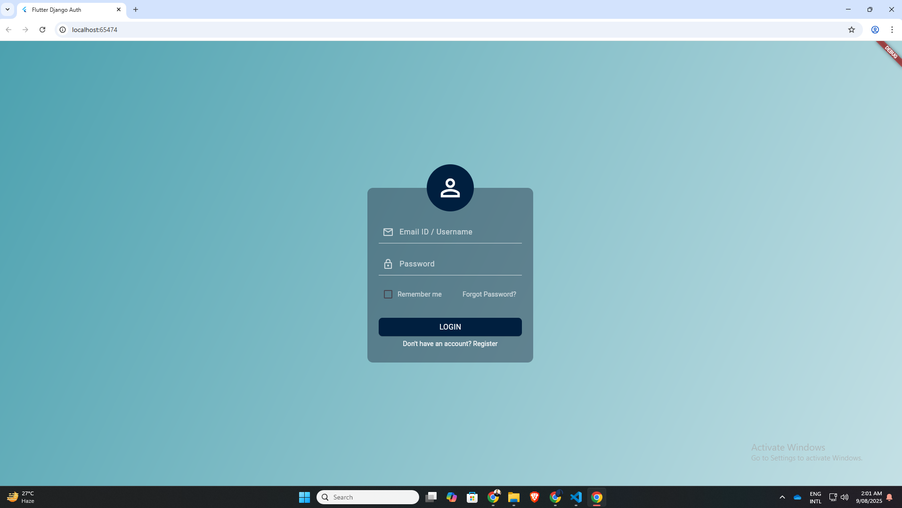
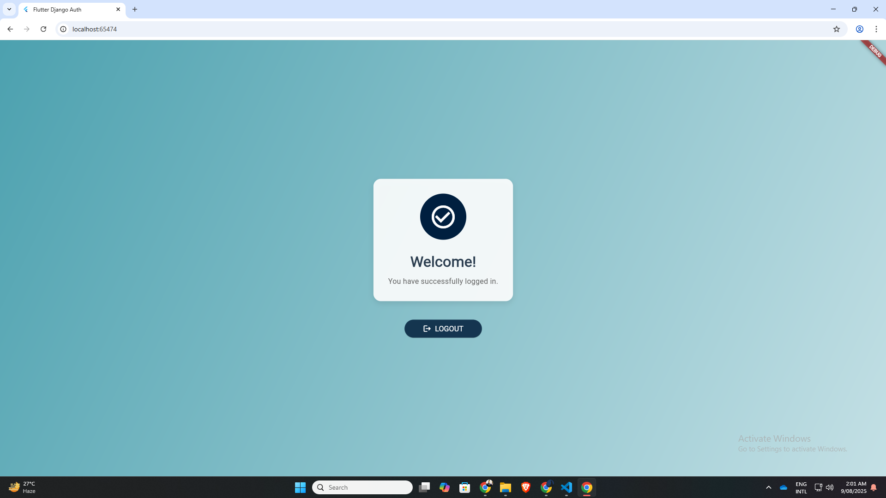
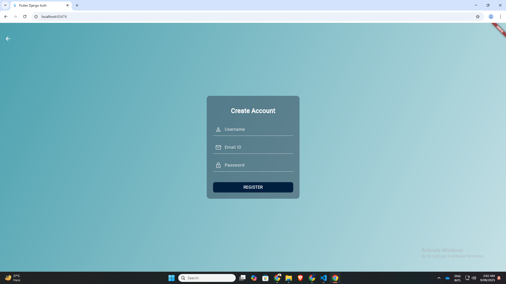
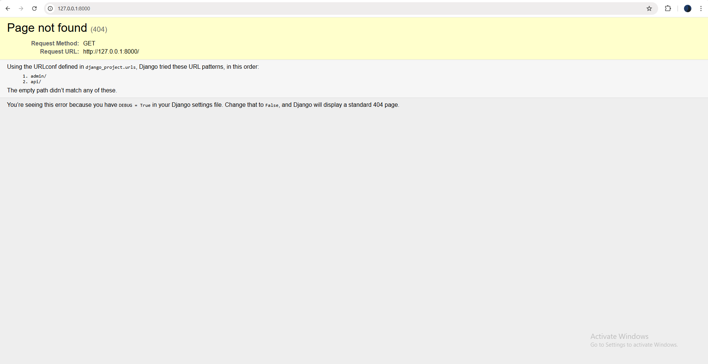

# Flutter & Django Login System

A **full-stack, cross-platform login and registration system** built with a **Flutter** frontend and a **Django REST Framework** backend.  
This application supports **Android, iOS, and Web** from a single codebase.

---

## 🚀 Features

- **Cross-Platform**: Single codebase for Android, iOS, and Web.
- **User Authentication**: Secure user registration and login.
- **Token-Based Auth**: Uses **JSON Web Tokens (JWT)** for session management.
- **REST API**: Robust backend powered by **Django REST Framework**.
- **Responsive UI**: Clean and modern design for all screen sizes.

---

## 🛠️ Tech Stack

### **Frontend**
- **[Flutter](https://flutter.dev/)** – Google's UI toolkit for building natively compiled apps.
- **Dart** – Programming language for Flutter.

### **Backend**
- **[Python](https://www.python.org/)** – High-level, versatile programming language.
- **[Django](https://www.djangoproject.com/)** – High-level Python web framework.
- **[Django REST Framework](https://www.django-rest-framework.org/)** – Toolkit for building Web APIs.
- **[Simple JWT](https://django-rest-framework-simplejwt.readthedocs.io/en/latest/)** – JWT authentication.


---

## ⚙️ Setup & Installation

### **Prerequisites**

- [Flutter SDK](https://flutter.dev/docs/get-started/install)
- [Python](https://www.python.org/downloads/) & pip
- [Git](https://git-scm.com/)

---

### ** Backend Setup (Django)**

```bash
*Clone the repository
git clone https://github.com/Nahian-Alvy/flutter-django-auth-system.git
cd flutter-django-auth-system/full_project

*Create & activate a virtual environment
python -m venv venv
# On Windows:
venv\Scripts\activate

#Apply migrations
python manage.py migrate

#Run the server
python manage.py runserver
```


### ** Frontend Setup (Flutter)**
## separate my_app folder and run it in different directory
```bash
# 1. Navigate to the Flutter project folder
cd ../my_app

# 2. Install dependencies
flutter pub get

# 3. Run the app
flutter run
```
### **Login Page After Running ** 
```bash
flutter run
```


### **Home Page After Successfully Login **


### **Register Page **


### **Backend Server Api **


